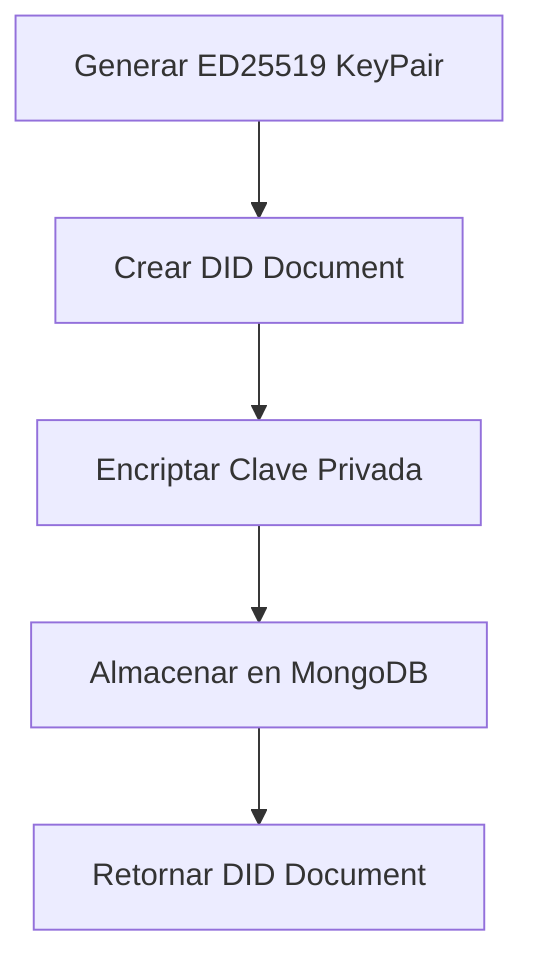
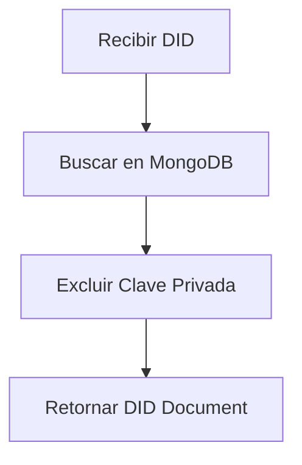

# Documentación Técnica - Seguridad y Criptografía

## Arquitectura de Seguridad

### 1. Generación de Claves (ED25519)
- Utilizamos el algoritmo ED25519 para la generación de pares de claves criptográficas
- Implementado a través de la biblioteca `tweetnacl`
- Características:
  - Firma digital de alta velocidad
  - Claves públicas de 32 bytes
  - Firmas de 64 bytes
  - Resistente a ataques de canal lateral

### 2. Almacenamiento Seguro de Claves Privadas

#### Proceso de Encriptación
1. Generación de IV (Vector de Inicialización)
   - 12 bytes aleatorios generados con `crypto.randomBytes()`
   - Único para cada operación de encriptación

2. Encriptación AES-256-GCM
   - Algoritmo: AES (Advanced Encryption Standard)
   - Modo: GCM (Galois/Counter Mode)
   - Características:
     - Encriptación autenticada
     - Protección contra manipulación
     - Verificación de integridad integrada

3. Estructura del Dato Encriptado
```
[IV (12 bytes)][Auth Tag (16 bytes)][Datos Encriptados]
```

### 3. Gestión de Claves de Encriptación

- La clave de encriptación se deriva usando SHA-256
- Proceso:
  1. Se toma la clave del ambiente (ENCRYPTION_KEY)
  2. Se aplica hash SHA-256 para obtener una clave de 32 bytes
  3. El resultado se usa como clave para AES-256-GCM

### 4. Seguridad en la API

- Las claves privadas nunca se exponen en las respuestas de la API
- Los documentos DID se almacenan con las claves privadas encriptadas
- El campo `encryptedPrivateKey` se excluye automáticamente en las consultas

### 5. Medidas de Seguridad Adicionales

1. Sanitización de Entradas
   - Validación de formatos DID
   - Verificación de tipos de datos

2. Seguridad en Base de Datos
   - Índices únicos para prevenir duplicados
   - Selección restrictiva de campos sensibles

3. Seguridad en Contenedores
   - Ejecución como usuario no-root
   - Imágenes base Alpine para superficie mínima de ataque

## Flujo de Operaciones Criptográficas

1. Creación de DID


2. Resolución de DID
